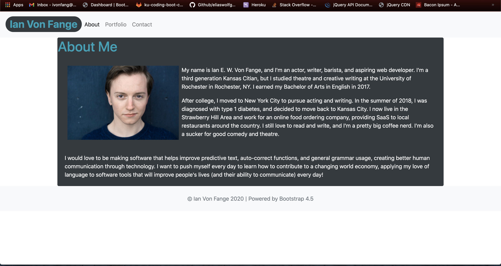
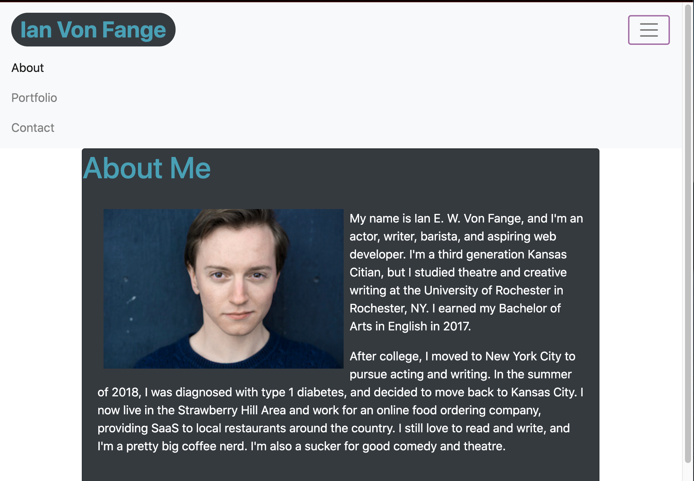
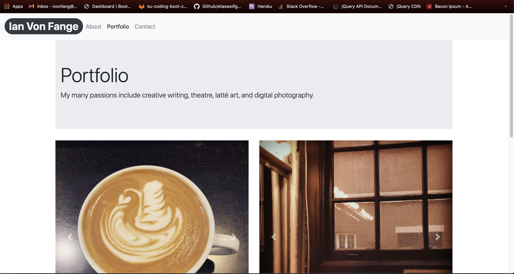
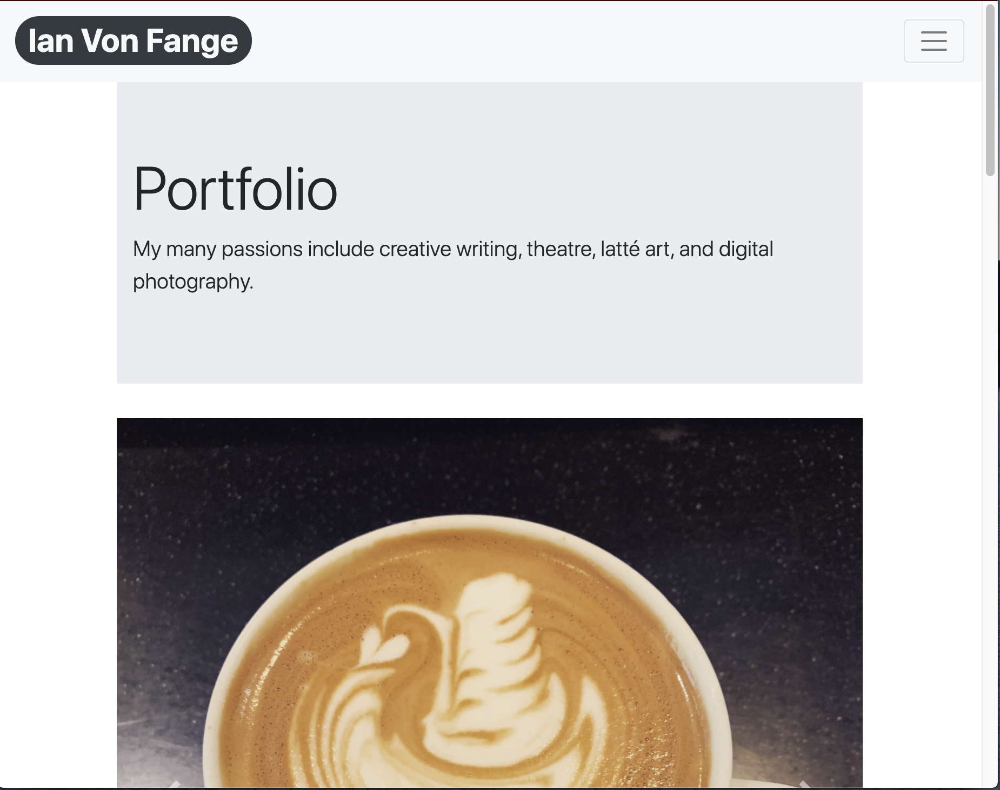

# Basic Portfolio
## Description
This is a basic version of a portfolio with responsive images, built entirely using Bootstrap v4.5.

Responsiveness was the priority in constructing this portfolio page. This site incorporates the following Bootstrap components (among others):
* Sticky header and footer, including a responsive navbar
* Forms and form groups
* Cards and badges
* Jumbotron and responsives carousels

## Screenshots
Below are screenshots of this site at different viewport widths, demonstrating its respsonsiveness.

